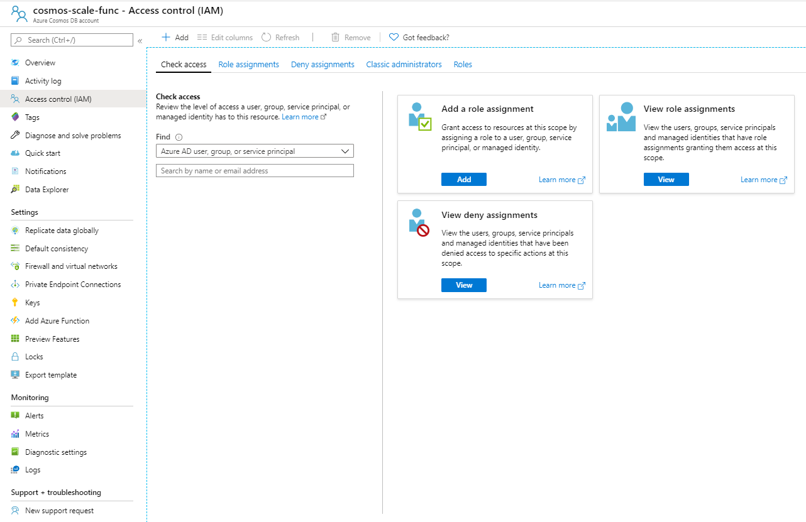
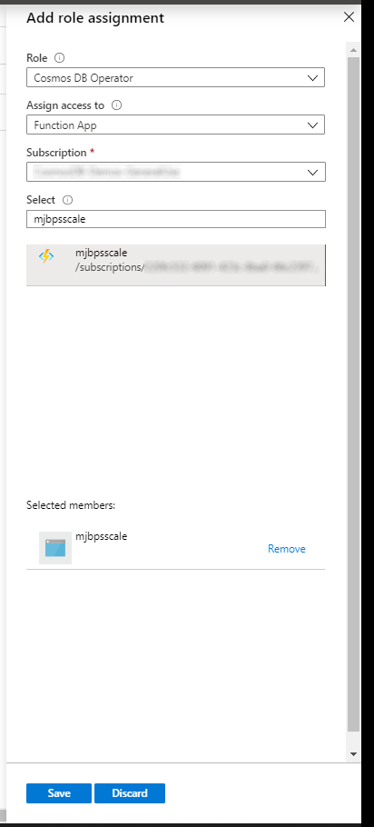

# Scale Cosmos DB using Azure Functions Timer Trigger

  

This Azure Functions project is designed to set throughput on Cosmos DB resources twice a day using two Timer Triggers. The triggers are written in PowerShell and call Az.CosmosDB cmdlets to set the throughput property on resources in Cosmos DB. Each trigger has its own `resources.json` file which defines what resources to set throughput on. Each trigger also has its own schedule, defined in `function.json`. The ScaleUpTrigger is configured to run at 8am UTC, Monday-Friday. The ScaleDownTrigger is configured to run at 6pm UTC Monday-Friday. When scaling resources the script will check the minimum throughput on the resource and ensure it is not set any lower to prevent an exception from being thrown. Otherwise, it will scale to the level you set. This sample cannot migrate between manual and autoscale throughput. If the wrong type of throughput is specified it will report an error and skip over it. If you set throughput on a resource that does not have throughput provisioned, it will report an error and skip over it. This Azure Function connects to the Cosmos resources using MSI. You will need to create an identity for the app and grant it permissions to the Cosmos accounts to set throughput on.

> [!IMPORTANT]
> If you are planning on setting throughput to a very large amount it is recommended you first do this through the portal before using this tool. Large scale up operations can take quite a bit of time the very first time you do them and may cause the Azure Function to time out or throw an exception waiting for the script to complete. Once you do the initial scale up, you can scale back down and then use this tool to automate.

## Prerequisites

- Before cloning this repo, follow the instructions on the Prerequisites section of this article here. [Create your first PowerShell function in Azure](https://docs.microsoft.com/azure/azure-functions/functions-create-first-function-powershell)
- If you're planning on debugging this project locally, see [Debug PowerShell Azure Functions locally](https://docs.microsoft.com/azure/azure-functions/functions-debug-powershell-local)
- If you're planning on making major customizations to this sample, check out the [Azure Functions PowerShell developer guide](https://docs.microsoft.com/azure/azure-functions/functions-reference-powershell)

## Setup

Clone the repository locally. Open in VS Code, then modify the following:

- **Resources:** Set the Cosmos DB resources to set throughput on for each trigger in `resources.json`
- **Schedule:** Set the schedule for each trigger in `function.json`
- **Deploy:** Deploy the Azure Functions app to your Azure subscription
- **Permissions:** Create system identity for the app and grant permissions

## Resources

Each trigger has its own `resources.json` file. This file specifies the Cosmos DB resources to set throughput on. You can add as many Cosmos DB resources as you want across any number of accounts and will work for all supported Cosmos DB model APIs (SQL, Cassandra, MongoDB, Gremlin, Table).

To scale a shared (database-level) or dedicated (container-level) resource, add an array entry to the file with the following attributes:

- **resourceGroupName** - resource group for the Cosmos DB account.
- **accountName** - Cosmos DB account name.
- **api** - Api type (sql, mongodb, cassandra, gremin, table).
- **throughputType** - (manual or autoscale).
- **resourceName** - database or database\container.
- **throughput** - throughput to set for the resource.

*resourceName* must be in `database` or `database\container` format. Some examples - SQL: `database1\container1`, Cassandra: `keyspace1\table1`, MongoDB: `database1\collection1`, Gremlin: `database1\graph1`, or Table: `table1`.

The example below demonstrates setting throughput on a database and a container resource in two different Cosmos accounts.

```json
{
    "resources":
    [
        {
            "resourceGroup": "MyResourceGroup",
            "account": "my-cosmos-account1",
            "api": "sql",
            "throughputType": "manual",
            "resourceName": "myDatabase1",
            "throughput": 400
        },
        {
            "resourceGroup": "MyResourceGroup",
            "account": "my-cosmos-account2",
            "api": "gremlin",
            "throughputType": "autoscale",
            "resourceName": "myDatabase2/myGraph1",
            "throughput": 4000
        }
    ]
}
```

## Schedule

Setting the schedule requires changing the "schedule" attribute in each Trigger's `function.json` to the desires cron expression. To learn more about cron expressions, see [NCRONTAB expressions](https://docs.microsoft.com/azure/azure-functions/functions-bindings-timer?tabs=csharp#ncrontab-expressions)

## Deploy

To deploy this app, in VS Code, press F1, choose, "Azure Functions: Deploy to Function app", follow prompts to deploy to existing or create new Functions app in Azure.

## Permissions

After the Azure Function app is deployed, you need to give it permissions to set throughput on every Azure Cosmos DB account it will access. To do this you need to create a system assigned identity in Azure and then give the system assigned identity Cosmos DB Operator rights to allow the Azure Function Triggers to set the throughput.

Follow these steps to do this.

### Step 1

Open the Azure Function app settings


### Step 2

Select Identity in Platform Features


### Step 3

Create a System assigned identity for the Azure Function


### Step 4

Open each Azure Cosmos DB account you want to let the Azure Function set the throughput for and select Access Control (IAM) and click on "Add" role assignments.


### Step 5

Finally, for "Role" select "Cosmos DB Operator", for "Assign access to" select " Function App", then select your subscription and the Azure Function app you have deployed this solution into. **Make sure you click Save**.



To test, run one of the triggers in the Azure Function and monitor the console output.

## Contributing

This project welcomes contributions and suggestions.  Most contributions require you to agree to a
Contributor License Agreement (CLA) declaring that you have the right to, and actually do, grant us
the rights to use your contribution. For details, visit https://cla.opensource.microsoft.com.

When you submit a pull request, a CLA bot will automatically determine whether you need to provide
a CLA and decorate the PR appropriately (e.g., status check, comment). Simply follow the instructions
provided by the bot. You will only need to do this once across all repos using our CLA.

This project has adopted the [Microsoft Open Source Code of Conduct](https://opensource.microsoft.com/codeofconduct/).
For more information see the [Code of Conduct FAQ](https://opensource.microsoft.com/codeofconduct/faq/) or
contact [opencode@microsoft.com](mailto:opencode@microsoft.com) with any additional questions or comments.
